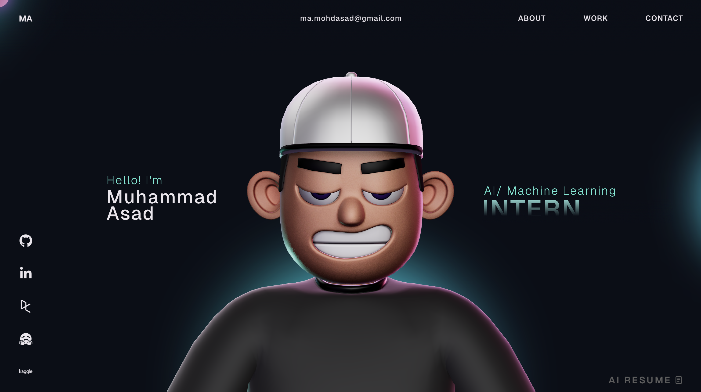

# My Portfolio Wesbite - Overview 🚀

This repository contains the open source version of my porfolio website.
Do check it out!

## Instructions 🛠️

This project now uses only deploy-safe packages and builds as a static Vite site.

## Free Hosting

The fastest free option for this repo is Vercel:

1. Push the repository to GitHub.
2. Import the repo at https://vercel.com/new.
3. Keep the default Vite settings.
4. Use `npm run build` as the build command if Vercel asks.
5. Deploy.

Vercel should detect the output directory as `dist` automatically.

**Techstack** - React, TypeScript, GSAP, ThreeJS, WebGL, HTML, Css, JavaScript

## License

This project is open source and available under the [MIT License](LICENSE).
